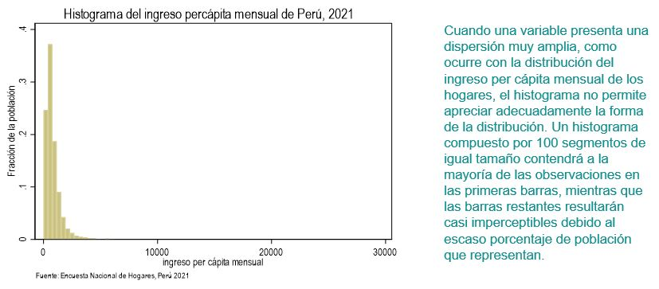
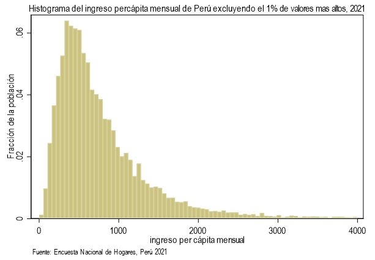
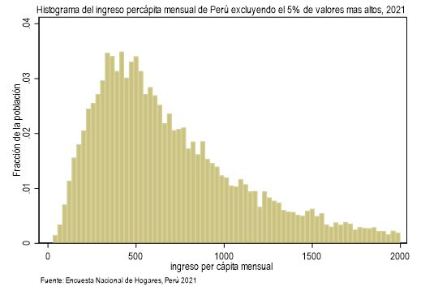
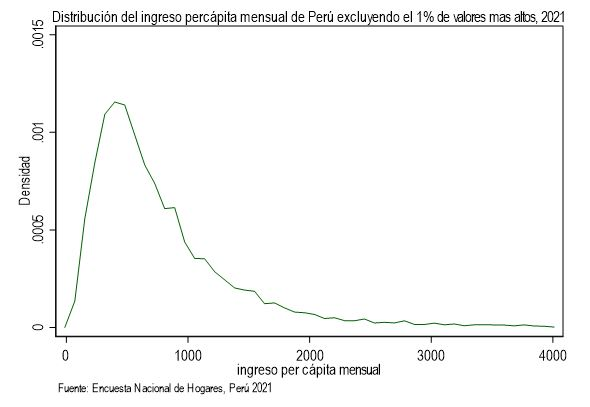

# Desigualdad monetaria con Stata


Medir la desigualdad es necesario para responder a preguntas como:

- ¿es la distribución de ingreso más o menos igualitaria que en el pasado?
- ¿Existe una desigualdad en el acceso a la educación en términos de género u origen étnico?
- ¿Cuál es la brecha salarial entre hombres y mujeres?
- ¿Cuál es la magnitud de la desigualdad en acceso a agua potable entre zonas
urbanas y rurales y cómo ha evolucionado en el tiempo? 

**OJO**
La medida de desigualdad que escojamos debe responder a la
pregunta específica que nos interesa, por lo que es importante conocer las diferentes formas de
medir la desigualdad y sus respectivas propiedades.
Atkinson (1970

## Herramientas visuales para el análisis de la desigualdad

Las gráficas son una herramienta visual que resume la información sobre la distribución de una variable, lo que permite al analista tener una idea de los valores extremos, la concentración y dispersión de la variable, así como su simetría.

### 1. Histograma y función de densidad

El histograma representa la distribución de una variable. Su construcción consiste en organizar de menor a mayor la población de estudio según el valor de la variable de análisis y dividir el rango de la variable en segmentos preferiblemente iguales.

El número de segmentos depende de la precisión requerida: entre mayor sea el número de segmentos, más semejante será el histograma a la distribución real de la variable. Sin embargo, reproducir la distribución de la variable en un histograma puede terminar en una gráfica confusa, con muchos saltos, que en últimas no simplifica la información de su variabilidad.

```
set scheme s1color

g facpob=factor07*mieperho
hist ipcm [fw=int(facpob)], fraction ytitle("Fracción de la población") xtitle("ingreso per cápita mensual") title("Histograma del ingreso percápita mensual de Perú, 2021") note("Fuente: Encuesta Nacional de Hogares, Perú 2021")
```



Debido a la amplia dispersión de la distribución del ingreso en la parte superior, basta con excluir del gráfico los valores correspondientes al 1% o 5% más rico para visualizar de manera más clara su distribución.

Excluyendo el 1%

```
sum ipcm [w=facpob], detail

                 Ingreso per cápita mensual
-------------------------------------------------------------
      Percentiles      Smallest
 1%     104.2556              0
 5%     182.7508       34.50232
(omitido)
95%     2101.439       26027.59       Skewness       5.389074
99%     4103.975       28911.83       Kurtosis       70.29174

hist ipcm [fw=int(facpob)] if ipcm<4000, fraction ytitle("Fracción de la población") xtitle("ingreso per cápita mensual") title("Histograma del ingreso percápita mensual de Perú excluyendo el 1% de valores mas altos, 2021", size(medsmall)) note("Fuente: Encuesta Nacional de Hogares, Perú 2021")
```


Excluyendo el 5%

```
sum ipcm [w=facpob], detail

                 Ingreso per cápita mensual
-------------------------------------------------------------
      Percentiles      Smallest
 1%     104.2556              0
 5%     182.7508       34.50232
(omitido)
95%     2101.439       26027.59       Skewness       5.389074
99%     4103.975       28911.83       Kurtosis       70.29174

hist ipcm [fw=int(facpob)] if ipcm<2000, fraction ytitle("Fracción de la población") xtitle("ingreso per cápita mensual") title("Histograma del ingreso percápita mensual de Perú excluyendo el 5% de valores mas altos, 2021", size(medsmall)) note("Fuente: Encuesta Nacional de Hogares, Perú 2021")
```


Una estimación no-paramétrica de la función de densidad de la variable por el método de kernels provee una representación suavizada de la información del histograma que resulta en una línea continua que bordea el histograma

```
kdensity ipcm [fw=int(facpob)] if ipcm<4000, ytitle("Densidad") xtitle("ingreso per cápita mensual") title("Distribución del ingreso percápita mensual de Perú excluyendo el 1% de valores mas altos, 2021", size(medsmall)) note("Fuente: Encuesta Nacional de Hogares, Perú 2021")
```


Si necesitamos comparar las distribución del ingreso per cápita mensual para el área urbano y rural, a través de la función de densidad de kernels, el comando Stata es el siguiente:

```
g area=estrato<=5
label define area 1 "Urbano" 0 "Rural"
label value area area

graph twoway (kdensity ipcm [fw=int(facpob)] if area==1) (kdensity ipcm [fw=int(facpob)] if area==0) if ipcm<4000, xline(1000)legend(label(1 "Urbano") label(2 "Rural")) title("Distribución del ingreso percápita mensual de Perú excluyendo el 1% de valores mas altos, 2021", size(medsmall)) ytitle("Densidad") xtitle("ingreso per cápita mensual") note("Fuente: Encuesta Nacional de Hogares, Perú 2021")
```

### 2. Función de distribución acumulada

La función de distribución acumulada es otra manera de visualizar la distribución de una variable. Esta función indica la proporción acumulada de individuos (eje vertical) para cada valor del rango de la variable (eje horizontal), y comienza en las coordenadas (0,0) para ir aumentando hasta llegar al valor máximo del rango de la variable, donde la proporción acumulada es igual a 1. Esto se debe a que toda la población tiene un valor de la variable igual o menor al valor máximo.

```
cumul ipcm [fw=int(facpob)], gen(cipcm)

twoway line cipcm ipcm [fw=int(facpob)], sort title("Función acumulada del ingreso per cápita mensual en el Perú, 2021",size(medsmall)) ytitle("Proporción acumulada de la población") xtitle("ingreso per cápita mensual")
```


