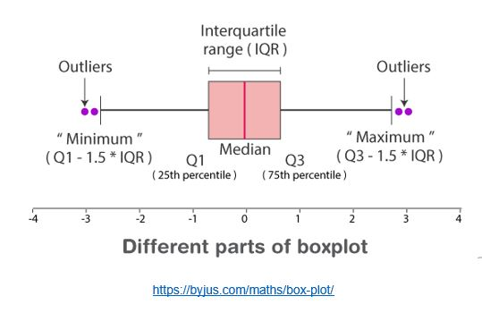
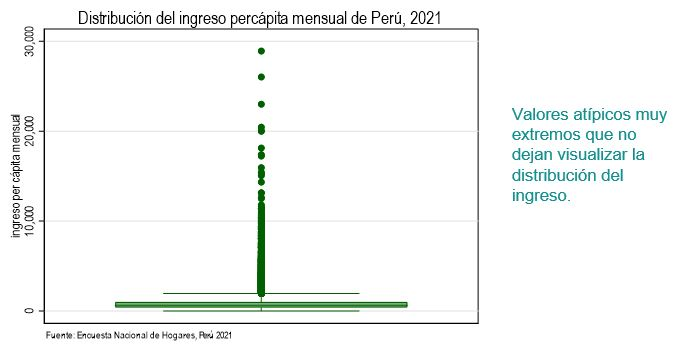
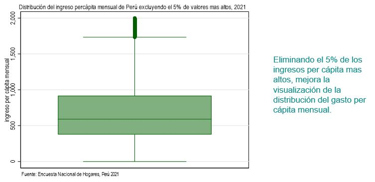
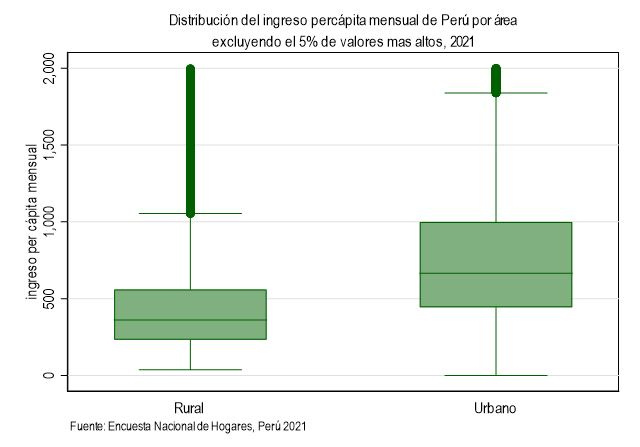
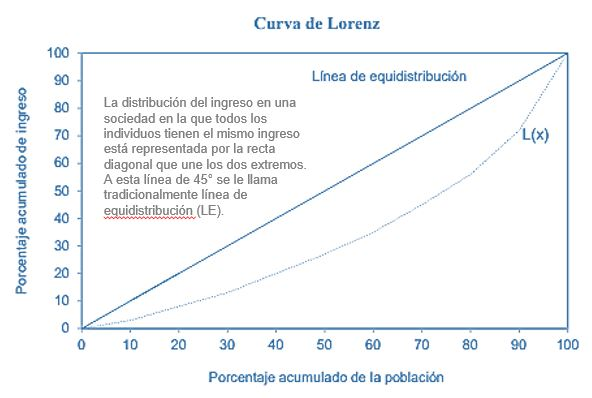
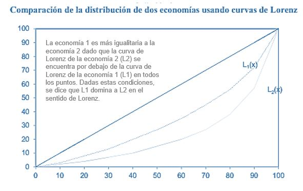
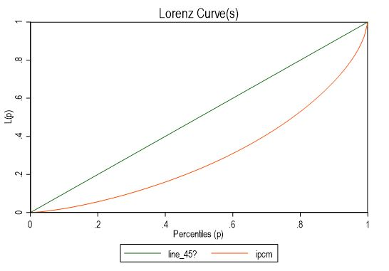
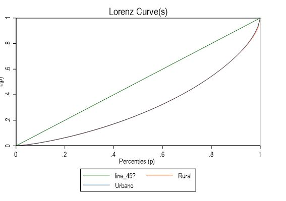
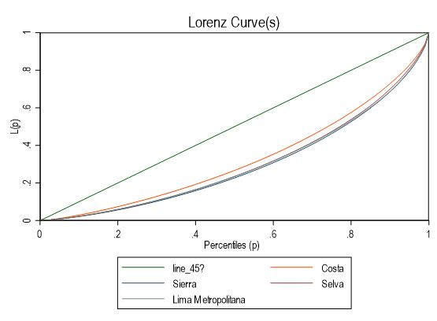
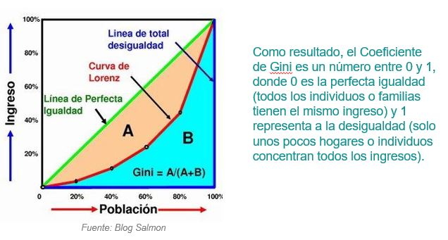

# Desigualdad monetaria con Stata


Medir la desigualdad es necesario para responder a preguntas como:

- ¿es la distribución de ingreso más o menos igualitaria que en el pasado?
- ¿Existe una desigualdad en el acceso a la educación en términos de género u origen étnico?
- ¿Cuál es la brecha salarial entre hombres y mujeres?
- ¿Cuál es la magnitud de la desigualdad en acceso a agua potable entre zonas
urbanas y rurales y cómo ha evolucionado en el tiempo? 

**OJO**
La medida de desigualdad que escojamos debe responder a la
pregunta específica que nos interesa, por lo que es importante conocer las diferentes formas de
medir la desigualdad y sus respectivas propiedades.
Atkinson (1970

## Herramientas visuales para el análisis de la desigualdad

Las gráficas son una herramienta visual que resume la información sobre la distribución de una variable, lo que permite al analista tener una idea de los valores extremos, la concentración y dispersión de la variable, así como su simetría.

### 1. Histograma y función de densidad

El histograma representa la distribución de una variable. Su construcción consiste en organizar de menor a mayor la población de estudio según el valor de la variable de análisis y dividir el rango de la variable en segmentos preferiblemente iguales.

El número de segmentos depende de la precisión requerida: entre mayor sea el número de segmentos, más semejante será el histograma a la distribución real de la variable. Sin embargo, reproducir la distribución de la variable en un histograma puede terminar en una gráfica confusa, con muchos saltos, que en últimas no simplifica la información de su variabilidad.

```
set scheme s1color

g facpob=factor07*mieperho
hist ipcm [fw=int(facpob)], fraction ytitle("Fracción de la población") xtitle("ingreso per cápita mensual") title("Histograma del ingreso percápita mensual de Perú, 2021") note("Fuente: Encuesta Nacional de Hogares, Perú 2021")
```


Debido a la amplia dispersión de la distribución del ingreso en la parte superior, basta con excluir del gráfico los valores correspondientes al 1% o 5% más rico para visualizar de manera más clara su distribución.

Excluyendo el 1%

```
sum ipcm [w=facpob], detail

                 Ingreso per cápita mensual
-------------------------------------------------------------
      Percentiles      Smallest
 1%     104.2556              0
 5%     182.7508       34.50232
(omitido)
95%     2101.439       26027.59       Skewness       5.389074
99%     4103.975       28911.83       Kurtosis       70.29174

hist ipcm [fw=int(facpob)] if ipcm<4000, fraction ytitle("Fracción de la población") xtitle("ingreso per cápita mensual") title("Histograma del ingreso percápita mensual de Perú excluyendo el 1% de valores mas altos, 2021", size(medsmall)) note("Fuente: Encuesta Nacional de Hogares, Perú 2021")
```


Excluyendo el 5%

```
sum ipcm [w=facpob], detail

                 Ingreso per cápita mensual
-------------------------------------------------------------
      Percentiles      Smallest
 1%     104.2556              0
 5%     182.7508       34.50232
(omitido)
95%     2101.439       26027.59       Skewness       5.389074
99%     4103.975       28911.83       Kurtosis       70.29174

hist ipcm [fw=int(facpob)] if ipcm<2000, fraction ytitle("Fracción de la población") xtitle("ingreso per cápita mensual") title("Histograma del ingreso percápita mensual de Perú excluyendo el 5% de valores mas altos, 2021", size(medsmall)) note("Fuente: Encuesta Nacional de Hogares, Perú 2021")
```


Una estimación no-paramétrica de la función de densidad de la variable por el método de kernels provee una representación suavizada de la información del histograma que resulta en una línea continua que bordea el histograma

```
kdensity ipcm [fw=int(facpob)] if ipcm<4000, ytitle("Densidad") xtitle("ingreso per cápita mensual") title("Distribución del ingreso percápita mensual de Perú excluyendo el 1% de valores mas altos, 2021", size(medsmall)) note("Fuente: Encuesta Nacional de Hogares, Perú 2021")
```


Si necesitamos comparar las distribución del ingreso per cápita mensual para el área urbano y rural, a través de la función de densidad de kernels, el comando Stata es el siguiente:

```
g area=estrato<=5
label define area 1 "Urbano" 0 "Rural"
label value area area

graph twoway (kdensity ipcm [fw=int(facpob)] if area==1) (kdensity ipcm [fw=int(facpob)] if area==0) if ipcm<4000, xline(1000)legend(label(1 "Urbano") label(2 "Rural")) title("Distribución del ingreso percápita mensual de Perú excluyendo el 1% de valores mas altos, 2021", size(medsmall)) ytitle("Densidad") xtitle("ingreso per cápita mensual") note("Fuente: Encuesta Nacional de Hogares, Perú 2021")
```

### 2. Función de distribución acumulada

La función de distribución acumulada es otra manera de visualizar la distribución de una variable. Esta función indica la proporción acumulada de individuos (eje vertical) para cada valor del rango de la variable (eje horizontal), y comienza en las coordenadas (0,0) para ir aumentando hasta llegar al valor máximo del rango de la variable, donde la proporción acumulada es igual a 1. Esto se debe a que toda la población tiene un valor de la variable igual o menor al valor máximo.

```
cumul ipcm [fw=int(facpob)], gen(cipcm)

twoway line cipcm ipcm [fw=int(facpob)], sort title("Función acumulada del ingreso per cápita mensual en el Perú, 2021",size(medsmall)) ytitle("Proporción acumulada de la población") xtitle("ingreso per cápita mensual")
```


Excluyendo el 5%

```
twoway line cipcm ipcm [fw=int(facpob)] if ipcm<2000, sort title("Función acumulada del ingreso per cápita mensual en el Perú",size(medsmall)) subtitle("excluyendo el 5% de valores mas altos, 2021",size(medsmall)) ytitle("Proporción acumulada de la población") xtitle("ingreso per cápita mensual")
```


### 3. Diagrama de caja (Box Plot)

El boxplot es una representación simplificada de la distribución de una variable en estudio. Consiste en una caja que muestra el rango intercuartílico, es decir, el primer y tercer cuartil de la distribución (percentiles 25 y 75 respectivamente). La línea central de la caja corresponde a la mediana (percentil 50), mientras que dos líneas verticales se extienden desde la caja hacia los valores más extremos de la distribución. Estas líneas indican el valor adyacente inferior y superior de la distribución. Los valores que se encuentran por encima o por debajo de estas líneas se conocen como valores atípicos y pueden o no ser incluidos en el gráfico. El eje vertical del diagrama muestra los valores de la variable que corresponden a cada punto de la distribución.

El boxplot es una herramienta visualmente útil para determinar el rango de valores de la variable en estudio, así como la mediana y la dispersión, medida por el rango intercuartílico que se representa mediante la altura de la caja. Sin embargo, cuando se incluyen valores atípicos en el diagrama de caja, su lectura puede ser difícil debido a que la mayoría de las observaciones se concentran en los valores intercuantílicos, lo que puede hacer que la caja se vea como una línea horizontal cercana al eje horizontal, de manera similar a lo que sucede con el histograma o la función de distribución acumulada.

Para evitar la dificultad de lectura que pueden causar los valores atípicos, se recomienda presentar el diagrama de caja eliminando dichos valores o sustituyéndolos por el percentil 95 o 99 (en la parte derecha de la distribución) y el percentil 1 o 5 (en la parte izquierda de la distribución), según corresponda. Además, cuando se representa la variable en una escala logarítmica, el diagrama de caja se vuelve más fácil de interpretar, incluso si se incluyen valores atípicos.



```
graph box ipcm [fw=int(facpob)], ytitle("ingreso per cápita mensual") title("Distribución del ingreso percápita mensual de Perú, 2021") note("Fuente: Encuesta Nacional de Hogares, Perú 2021")
```


Excluyendo el 5%

```
graph box ipcm [fw=int(facpob)] if ipcm<2000, ytitle("ingreso per cápita mensual") title("Distribución del ingreso percápita mensual de Perú excluyendo el 5% de valores mas altos, 2021",size(medsmall)) note("Fuente: Encuesta Nacional de Hogares, Perú 2021")
```


¿Cómo se distribuye por área urbano / rural?

```
graph box ipcm [fw=int(facpob)] if ipcm<2000, over(area) ytitle("ingreso per cápita mensual") title("Distribución del ingreso percápita mensual de Perú por área", size(medsmall)) subtitle("excluyendo el 5% de valores mas altos, 2021", size(medsmall)) note("Fuente: Encuesta Nacional de Hogares, Perú 2021")
```


### 4. La curva de Lorenz

La curva de Lorenz es una representación de la distribución del ingreso de una población (Lorenz, 1905). Esta curva tiene en el eje horizontal el porcentaje acumulado de individuos desde el más pobre hasta el más rico y en el eje vertical el porcentaje de ingreso perteneciente a cada porcentaje acumulado de la población.




Si una distribución domina en el sentido de Lorenz a otra, entonces todos los índices de desigualdad que cumplen la propiedad de Dalton-Pigou en sentido estricto reportan una menor desigualdad para la distribución dominante. Esta propiedad es muy útil puesto que, si existe dominancia de Lorenz entre dos distribuciones, es posible determinar sin ambigüedad cuál distribución es más equitativa, independiente del índice elegido para cuantificar la desigualdad. La magnitud de la diferencia sí depende del índice de desigualdad elegido.

¿Cómo generamos la curva de Lorenz en Stata?

```
ssc install clorenz
```

Clorenz puede producir las siguientes curvas distribucionales para una lista dada de variables:

- Curvas de Lorenz
- Curvas de Lorenz generalizadas
- Curvas de concentración
- Curvas de concentración generalizadas

#### Curva de Lorenz del ingreso per cápita mensual del Perú, 2021

```
clorenz ipcm, hweight(facpob)
```



#### Curva de Lorenz del ingreso per cápita mensual en área urbana y rural del Perú, 2021

```
clorenz ipcm, hweight(facpob) hgroup(area)
```



#### Curva de Lorenz del ingreso per cápita mensual en dominios costa, sierra, selva y lima metropolitana del Perú, 2021

```
recode dominio (1/3=1) (4/6=2) (7=3) (8=4), g(gdominio)
label define gdominio 1 "Costa" 2 "Sierra" 3 "Selva" 4 "Lima Metropolitana"
label value gdominio gdominio
clorenz ipcm, hweight(facpob) hgroup(gdominio)
```



La propiedad de que las curvas de Lorenz más cercanas a la línea de equidistribución representen distribuciones más igualitarias, ha llevado a la creación de índices de desigualdad que usan la distancia entre la curva de Lorenz y la línea de equidistribución como medida de desigualdad. Uno de estos es el coeficiente de Gini.

## Índices para el análisis de la desigualdad

En términos precisos, se afirma que se produce una situación de desigualdad cuando al menos dos personas presentan niveles distintos de una variable analizada. Bajo esta óptica, todas las sociedades tienen algún grado de desigualdad, aunque no necesariamente en la misma medida. Por lo tanto, es importante medir el nivel de desigualdad de una variable de interés utilizando índices que permitan comparaciones, por ejemplo, a lo largo del tiempo o entre distintos países o grupos de individuos.

### 1. Cocientes entre cuantiles

Después de ordenar a la población según su nivel de ingreso per cápita, por ejemplo, se divide en grupos de igual tamaño, llamados cuantiles. Esta división se hace generalmente en cinco partes iguales (quintiles), en 10 partes iguales (deciles) o en 100 partes iguales (percentiles).

El indicador consiste en calcular el cociente entre la media de la variable de análisis x entre dos cuantiles, generalmente situados en lugares opuestos en la distribución.

El cociente de ingresos $C_{Mm}$ es simplemente el ratio del ingreso medio (o mediano) del percentil superior $M$ sobre el ingreso promedio (o mediano) del percentil inferior $m$.

$C_{Mm}=\frac{\overline{X}_M}{\overline{X}_m}$

Por lo general, el cociente se calcula para los cuantiles extremos, por ejemplo entre los deciles 1 y 10, para dar cuenta del tamaño que pueden alcanzar las brechas sociales. No obstante, algunos analistas también estudian cocientes de cuantiles intermedios, como por ejemplo el cociente entre el percentil 25 y el 75, con el fin de evitar valores extremos y de complementar el análisis estudiando varios puntos de la distribución.

#### ¿Cuál es el cociente entre el quintil mas rico y el quintil mas pobre cuando la variable de análisis es el ingreso per cápita mensual, en el Perú 2021?

```
xtile quintil = ipcm [pw=facpob], nq(5)
tabstat ipcm [w=facpob], by(quintil) s(mean p50)

 quintil |      Mean       p50
---------+--------------------
       1 |  237.7142  248.0896
       2 |  432.0285  430.6814
       3 |  624.9996  620.5067
       4 |  918.3585  905.1965
       5 |  1966.036   1562.19
---------+--------------------
   Total |  835.7143  620.4998
------------------------------

disp 1966.036/237.7142
8.2705871
```

#### ¿Cuál es el cociente entre el decil mas rico y el quintil mas pobre cuando la variable de análisis es el ingreso per cápita mensual, en el Perú 2021?

```
xtile decil = ipcm [pw=facpob], nq(10)
tabstat ipcm [w=facpob], by(decil) s(mean p50)

   decil |      Mean       p50
---------+--------------------
       1 |  175.8804  182.7508
       2 |  299.5442  301.0167
       3 |  388.3011   388.488
       4 |  475.7487  474.7239
       5 |  568.5087  568.4942
       6 |  681.4806  680.8495
       7 |  822.7414  822.2264
       8 |  1013.878  1008.262
       9 |   1327.56  1312.078
      10 |  2604.136  2101.439
---------+--------------------
   Total |  835.7143  620.4998
------------------------------

disp 2604.136/175.8804
14.806289
```

### 2. Participación de cuantiles

La participación de cuantiles es el porcentaje de la suma del valor de la variable de análisis (x) generalmente del cuantil superior o inferior, con respecto a la suma de para toda la población.

La participación de algún percentil superior M en el ingreso total, está dada por la siguiente expresión:

$P_M=\frac{\sum_{i \epsilon M}X_i}{\sum_{i}X_i}$

Es usual también utilizar la participación de algún percentil inferior (por ejemplo, la participación en el ingreso nacional del primer quintil), aunque en este caso debe tenerse en cuenta que un aumento del indicador refleja una caída de la desigualdad y no un incremento.

#### ¿Cuánto representa el ingreso captado por el quintil mas rico respecto al total del ingreso de la población?

```
tabstat ipcm [w=facpob], by(quintil) s(sum) format(%20.2g)


 quintil |                  Sum
---------+---------------------
       1 |           1581931418
       2 |           2874984146
       3 |           4158851115
       4 |           6113318656
       5 |          13076343734
---------+---------------------
   Total |          27805429069
-------------------------------

disp  13076343734/27805429069*100
47.028024
```

#### ¿Cuánto representa el ingreso captado por el quintil mas pobre respecto al total del ingreso de la población?

```
disp 1581931418/27805429069*100
5.6892897
```

### 3. El coeficiente de Gini

Este es el índice más usado para medir la desigualdad y fue propuesto por Gini (1921). El coeficiente es igual a la proporción del área entre la curva de Lorenz y la línea de equidistribución (área A del gráfico) con respecto a toda el área por debajo de la línea de equidistribución (correspondiente a A+B en el gráfico, que es igual a 0.5 dada la simetría de los rangos de la curva de Lorenz).



```
summ ipcm [w=facpob] if ipcm>0
* poblacion de referencia
local obs = r(sum_w)
* media ingreso
local media = r(mean)
sort ipcm
* suma acumulada del ponderador (población)
gen aux = sum(facpob) if ipcm>0
* ubicación promedio en el ranking de ingresos de persona en la población
gen i = (2*aux - facpob + 1)/2
gen aux2 = ipcm*(`obs'-i+1)
summ aux2 [w=facpob]
local gini = 1 + (1/`obs') - (2/(`media'*`obs'^2)) * r(sum)
display "gini = `gini'“

gini = .4091186292467571
```

### 3. Índice de desigualdad de Theil

Theil (1967) propuso un indicador para medir la desigualdad con base en el concepto de entropía, derivado de la teoría de la información. La entropía describe cuánta aleatoriedad hay en una señal o evento; el grado de entropía de un evento es una función decreciente de su probabilidad de ocurrencia. Haciendo un paralelismo entre este concepto y la desigualdad distributiva, Theil propuso el siguiente índice:

$T=\frac{1}{N}\sum_{i}\frac{x_i}{\mu}ln(\frac{x_i}{\mu})$

$T \epsilon [0, lnN]$

donde: $N$ = número total de individuos; $x_i$ = ingreso del individuo i y $μ$ = ingreso promedio de los individuos.

```
summ ipcm [w=facpob] if ipcm>0
local media = r(mean)

gen termino = ipcm/`media'*ln(ipcm/`media')
summ termino [w=facpob]
local theil = (r(sum)/r(sum_w))

display "Theil = `theil'“

Theil = .3066722601117096
```

### 4. Índice de Atkinson

Atkinson (1970) propone un índice flexible que permite al analista elegir las ponderaciones de acuerdo a sus juicios de valor y evaluar la sensibilidad de los resultados bajo ponderaciones alternativas.

$A=1- \frac{[\frac{1}{N}\sum_{i}x_i^{1-\epsilon}]^{\frac{1}{1-\epsilon}}}{\mu}, \epsilon &ge; 0, \epsilon &ne; 1$

El parámetro $\epsilon$ se interpreta como el grado de “aversión a la desigualdad”: a medida que aumenta el valor de ε, se otorga una ponderación más alta a las transferencias en el extremo inferior de la distribución. Un valor de ε  = 0 implica indiferencia ante la desigualdad y por tanto resulta en A = 0. Cuando ε  tiende a infinito, el índice es sensible solo a la situación del individuo con menores ingresos. Es común calcular este índice con valores de ε de 0.5, 1.0 y 1.5.

El índice se puede interpretar además haciendo uso de la noción de ingreso “igualmente distribuido”: si la desigualdad es alta (por ejemplo, A = 0.90), bastaría con que todos reciban el 10% (1-A = 0.10) del ingreso medio para alcanzar el mismo nivel de bienestar actual; por el contrario, si A es bajo (A=0.20), el ingreso a equidistribuir no es mucho menor que el ingreso medio observado (en este caso, 1-A = 80%).

```
* parametro aversión desigualdad
local epsilon = 0.5

summ ipcm [w=facpob] if ipcm>0
local obs = r(sum_w)
local media = r(mean)
drop termino

* epsilon == 1
if `epsilon' == 1 {
generate termino = ln(ipcm/`media')
summ termino [w=facpob]
local atk = 1 - exp(1/`obs'*r(sum))}
* epsilon != 1
else {
generate termino = (ipcm/`media') ^ (1-`epsilon')
summ termino [w=facpob]
local atk = 1 - (r(sum)/`obs') ^ (1/(1-`epsilon'))}

display as text "Atkinson(e=`epsilon') = " as result `atk‘

Atkinson(e=.5) = .13758118
```

### Comandos en Stata para estimar índices de desigualdad

#### INEQUAL
Muestra las siguientes medidas: desviación media relativa, coeficiente de variación, desviación estándar de los registros, índice de Gini, índice de Mehran, índice de Piesch, índice de Kakwani, índice de entropía de Theil y desviación media logarítmica.

#### INEQUAL7
Calcula una serie de medidas de desigualdad. Es una versión revisada y mejorada de "inequal".
Las medidas de desigualdad calculadas son: la "desviación media relativa", el "coeficiente de variación", la "desviación estándar de los registros", el "índice de Gini", el "índice de Mehran", el "índice de Piesch", el "índice de Kakwani", el "índice de entropía de Theil", la "desviación media logarítmica" y la "medida de entropía generalizada" con parámetros de sensibilidad -1 y 2.

```
* instalamos los comandos

ssc install inequal
ssc install inequal7

inequal ipcm [fw=int(facpob)]

inequality measures of ipcm
------------------------------------------------------------------------------
relative mean deviation                .29340571
coefficient of variation               .97989317
standard deviation of logs             .74608171
Gini coefficient                       .40910131
Mehran measure                         .53382619
Piesch measure                         .34673889
Kakwani measure                        .14502656
Theil entropy measure                  .30664945
Theil mean log deviation measure       .28892815
------------------------------------------------------------------------------

inequal7 ipcm [w=facpob]
(analytic weights assumed)
Warning: ipcm has 1 values == 0 *used* in calculations
    (except for SD logs, GE(-1), GE(0) (Mean log-deviation) and GE(1) (Theil)).

-----------------------------------------------------
                     Inequality measures |       ipcm
-----------------------------------------+-----------
                 Relative mean deviation |    0.29342
                Coefficient of variation |    0.97997
              Standard deviation of logs |    0.74612
                        Gini coefficient |    0.40912
                          Mehran measure |    0.53389
                          Piesch measure |    0.34674
                         Kakwani measure |    0.14504
              Theil index (GE(a), a = 1) |    0.30667
       Mean Log Deviation (GE(a), a = 0) |    0.28896
           Entropy index (GE(a), a = -1) |    0.38353
Half (Coeff.Var. squared) (GE(a), a = 2) |    0.48016
-----------------------------------------------------
```

#### ¿Cómo calculamos sus errores estándar?

Utilizaremos bootstrap, que es un método de simulación mediante remuestreo que se puede usar para estimar desviaciones estándar de un estadístico, intervalos de confianza de ese estadístico o incluso en contraste de hipótesis.

Debemos utilizar un comando que estime el índice de desigualdad requerido y que este retorne los valores es escalares que puedan ser utilizados por el comando bootstrap de Stata. La ayuda del comando inequal7 nos indica lo siguiente:

```
Saved Results

For historical reasons, inequal7 returns results in r() locals and in global macros.  However, to allow using inequal7 with the bootstrap or jkknife commands, results can be saved in r() scalars by specifying the returnscalars option.

[Important notice: When multiple variables are entered in varlist, returned results are the inequality measures of the last variable listed.]

    r(rmd) and S_1 contain the "relative mean deviation"
    r(cov) and S_2 contain the "coefficient of variation"
    r(sdl) and S_3 contain the "standard deviation of logs"
    r(gini) and S_4 contain the "Gini coefficient"'
    r(mehran) and S_5 contain the "Mehran index"
    r(piesch) and S_6 contain the "Piesch index"
    r(kakwani) and S_7 contain the "Kakwani index"
    r(theil) and S_8 contain the "Theil index (or generalised entropy measure with sensitivity parameter 1)"
    r(mld) and S_9 contain the "Mean Log Deviation (or generalised entropy measure with sensitivity parameter 0)"
    r(ge_1) and S_10 contain the "Generalised entropy measure with sensitivity parameter -1"
    r(ge2) and S_11 contain the "Generalised entropy measure with sensitivity parameter 2"
```

Para estimar el índice de Gini y su erros estándar utilizamos el siguiente comando:

```
bootstrap gini=real(r(gini)), reps(200) force strata(estrato) cluster(conglome): inequal7 ipcm [w=int(facpob)]
(running inequal7 on estimation sample)

warning: inequal7 does not set e(sample), so no observations will be excluded from the resampling because of missing values or other reasons. To exclude observations, press Break, save the data, drop any observations that are to be excluded, and rerun bootstrap.

Bootstrap replications (200)
----+--- 1 ---+--- 2 ---+--- 3 ---+--- 4 ---+--- 5 
..................................................    50
..................................................   100
..................................................   150
..................................................   200

Bootstrap results

Number of strata = 8                                Number of obs = 33,254,164
                                                    Replications  =        200

      Command: inequal7 ipcm [fweight= int(facpob)]
         gini: real(r(gini))

                            (Replications based on 5,359 clusters in conglome)
------------------------------------------------------------------------------
             |   Observed   Bootstrap                         Normal-based
             | coefficient  std. err.      z    P>|z|     [95% conf. interval]
-------------+----------------------------------------------------------------
        gini |   .4091042   .0036423   112.32   0.000     .4019654    .4162431
------------------------------------------------------------------------------
```

## Descomposición del índice de Gini

¿Por qué descomponerlo?

- El coeficiente de Gini es ampliamente utilizado para medir la desigualdad en la distribución del ingreso, la riqueza, gastos, etc.
- Al descomponer esta medida se puede entender los determinantes de la desigualdad

Lerman y Yitzhaki (1985 ) muestran que el coeficiente de Gini para el ingreso total, G, se puede representar como :

$$G=\sum_{k=1}^{K}S_kG_kR_k$$
